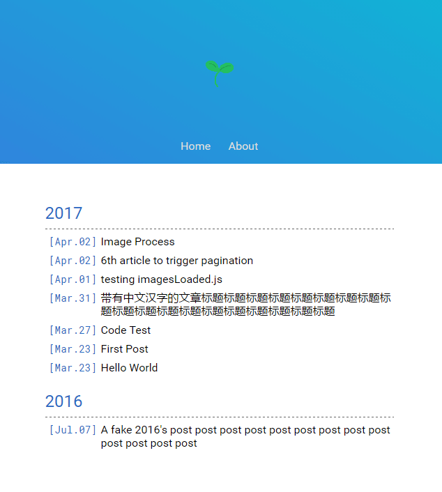

# Transient

A simple theme for [Hexo](https://hexo.io)

Here is the [Preview](http://journey1969.com)



## Installation & Enable

1. Install

   ``` bash
   $ git clone https://github.com/Journey1969/hexo-theme-transient.git
   ```

2. Enable

   Modify `theme` setting in `_config.yml` to `transient`.

## jQuery relatived

- jQuery

- [imagesLoaded.js](http://imagesloaded.desandro.com/)

- [fancybox.js](http://fancybox.net/)

## To Improve

- 在`config.yml`中开启了[资源文件管理功能](https://hexo.io/zh-cn/docs/asset-folders.html)后，使用以下方式引用的图片将会进行**懒加载**和**原图预加载**，而用``的方式引用则只会正常加载。
  ```
  
  ```

## TODO

[√] basic theme style

[√] code highlight

[√] mobile adaption

[√] fancybox

[√] images loading animation & placeholder

[×] media query

[√] page: archives

[√] page: about

[√] i18n support: English and Simplified Chinese
