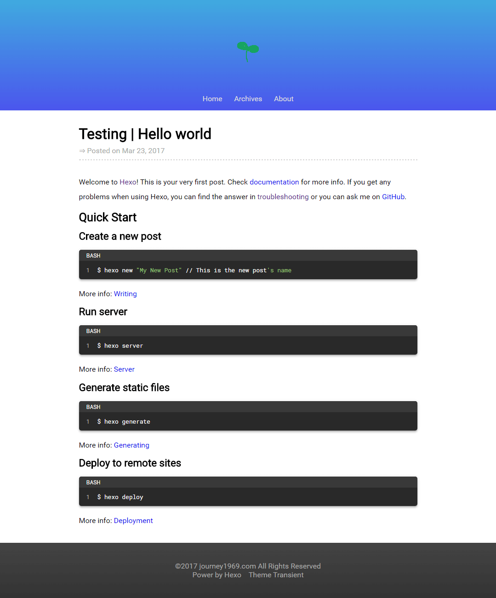

# Transient

一个最简化的[Hexo](https://hexo.io)主题，[在线预览](http://journey1969.com)




## 安装

在Hexo项目根目录下执行：
 ``` bash
 $ git clone https://github.com/Journey1969/hexo-theme-transient.git themes/transient
 ```

 
## 启用主题

修改项目根目录中的`_config.yml`，将`theme`字段的值修改为`transient`
``` yml
# Extensions
## Plugins: https://hexo.io/plugins/
## Themes: https://hexo.io/themes/
theme: transient
```


## 启用关于(About)页

启用主题后，访问`/about`路径会提示`Cannot GET /about/`，需要进行以下操作：

1. 在项目根目录下执行：

  ``` bash
  $ hexo new page about
  ```

2. 修改`/source/about/index.md`中的内容为：

  ```
  ---
  layout: about
  ---
  ```

这样，关于页的内容将会以`/themes/transient/layout/about.ejs`为模板进行渲染。

关于页为自定义页面，默认内容为主题作者的个人信息。可以通过修改主题中的`about.ejs`和`_about.styl`来自定义内容。


## Meta标签

用户需要自行修改`/themes/transient/_config.yml`中`meta`的各子项来正确定义页面头部的meta信息

``` yml
# meta in head
meta:
  author: YOUR_NAME
  description: YOUR_NAME's Blog
  keywords: YOUR_NAME, Blog
  og:
    site_name: YOUR_NAME
    description: YOUR_NAME's Blog
    type:
      article: article
```


## Features

- 高度简化，至多包含4种页面：首页，文章，档案，关于

- 可以将首页(Home)设置为档案页(Archives)，进一步简化

- 使用 [fancybox](http://fancybox.net/) 优化图片查看体验

- 使用 [lazyload](http://www.appelsiini.net/projects/lazyload) 进行图片懒加载

- 支持代码高亮

- 字体：英文为`Roboto`，代码为`Roboto Mono`，简体中文为`微软雅黑`(Win)或`思源黑体`(Mac)


## 更多细节
请查阅本主题的 [Wiki](https://github.com/Journey1969/hexo-theme-transient/wiki)
